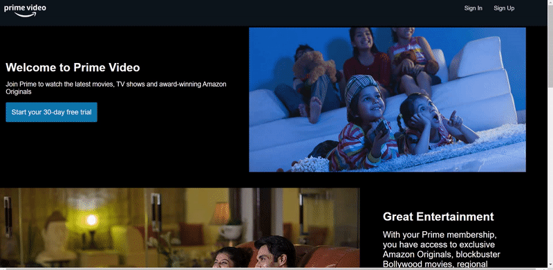
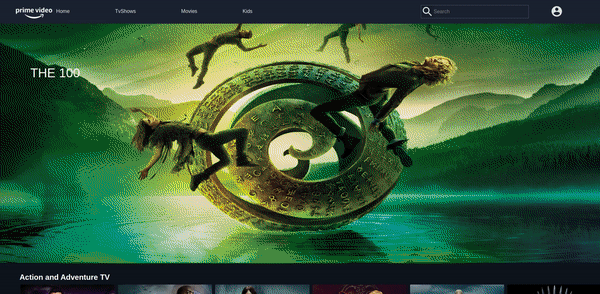
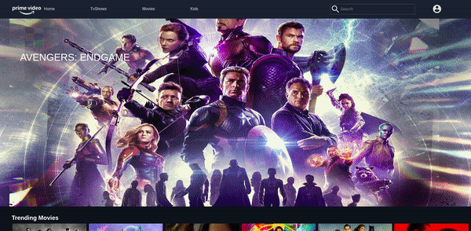

# Projeto Final Arquitetura Web


### Signin page


### Home page


### Tv Shows page


### Movies page



**Reference** : 

* Código fonte 
    https://github.com/bhagat-hrishi/amazon-prime-clone.git

* Consumo do TMDB API para informações dos filmes e séries
    https://developers.themoviedb.org/3


**There are two methods for getting started with this repo.**


#### Como executar

```
> cd client
> npm install
> npm start
> cd server 
> npm install
> node index
```


**Configuração para o arquivo .env para o Front e o Back** 
* Note 
    
    Criar *.env*  na pasta do client e do server

*  Conteúdo do .env para o client

    REACT_APP_API_KEY = Enter your tmdb api key

* Conteúdo do .env para o server

    MONGO_ATLAS_PW = dbpassword

    DB_URL = db url from mongodb atlas

    FEEDBACK_GMAIL = email id

    CLIENT_ID = client id

    CLIENT_SECRET = client secret

    REDIRECT_URI = https://developers.google.com/oauthplayground

    REFRESH_TOKEN = refresh token


